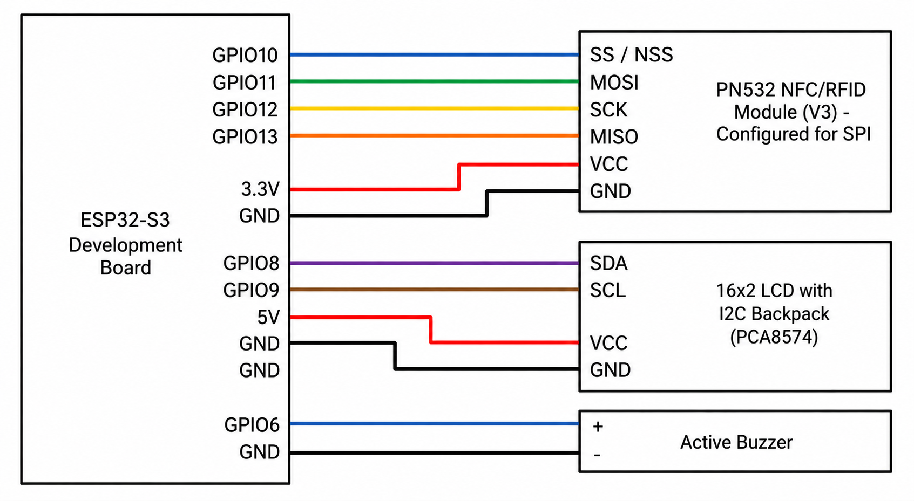

# RFID Access Control (ESP32-S3)


[](#)


[](LICENSE.md)

---

A standalone RFID access controller: ESP32-S3 + PN532 (hardware SPI) + 16x2
I2C LCD + a LittleFS-backed JSON user database. The board works completely
on its own with no PC attached; a Python CLI is provided for administration
(adding/removing/renaming users, batch import/export, tag renewal, Wi-Fi
provisioning, NTP time management, and card-UID scan mode). Users have an
expiration date checked against an NTP-synced clock, and a passive buzzer
gives audible pass/fail feedback. The database supports up to **10000 users**
backed by PSRAM (8MB on ESP32-S3).

---

## 1. Hardware Required

| Component                | Notes                                                        |
|---------------------------|---------------------------------------------------------------|
| ESP32-S3 dev board         | QFN56, rev v0.2, 8MB Octal PSRAM, 16MB Flash, 40MHz XTAL (as tested) |
| PN532 NFC/RFID module V3   | Must be set to **SPI mode** via onboard DIP switches, see Section3 |
| 16x2 LCD with PCA8574 I2C backpack | Address is usually `0x27` or `0x3F`, see Section 7 troubleshooting |
| Passive buzzer              | Connected to GPIO 6, see Section 4b |
| USB-C / micro-USB cable    | Data-capable, not charge-only                                 |
| Breadboard + jumper wires  |                                                                |
| Wi-Fi network (2.4GHz)     | Required for NTP time sync -- see Section 6c                   |

## 2. Software Required

- **Arduino IDE 2.x**
- **ESP32 board package** (via Boards Manager), v3.x recommended
- **Libraries** (Library Manager):
  - `Adafruit PN532`
  - `LiquidCrystal I2C` (Frank de Brabander / Marco Schwartz fork)
  - `ArduinoJson` (v7.x)
  - `WiFi` and `Preferences` -- ship with the ESP32 board package
- **Python 3.9+** for the CLI, with `pip install -r python_cli/requirements.txt`

---

## 3. PN532: Configuring SPI Mode

| SW1 | SW2 | Mode                  |
|-----|-----|-----------------------|
| ON  | OFF | **SPI** (use this)    |
| OFF | OFF | HSU (UART)            |
| OFF | ON  | I2C                   |
| ON  | ON  | Reserved / invalid    |

Set **SW1 = ON, SW2 = OFF**. If `getFirmwareVersion()` prints `0x0` at boot,
DIP switches are wrong or MISO/MOSI are swapped.

---

## 4. Wiring

<br/>

> 

<br/>

### SPI: ESP32-S3 to PN532

| ESP32-S3 GPIO | PN532 Pin | Signal |
|----------------|-----------|--------|
| GPIO 12        | SCK       | SPI Clock |
| GPIO 13        | MISO      | SPI Master In |
| GPIO 11        | MOSI      | SPI Master Out |
| GPIO 10        | SS / NSS  | Chip Select |
| 3V3            | VCC       | Power (do **not** use 5V) |
| GND            | GND       | Ground |

### I2C: ESP32-S3 to 16x2 LCD

| ESP32-S3 GPIO  | LCD Backpack Pin  | Signal |
|----------------|-------------------|--------|
| GPIO 8         | SDA               | I2C Data |
| GPIO 9         | SCL               | I2C Clock |
| 5V             | VCC               | Power (May require an external power supply) |
| GND            | GND               | Ground |

### 4b. Buzzer (passive)

| ESP32-S3 GPIO | Buzzer Pin | Signal |
|----------------|-----------|--------|
| GPIO 6         | Signal/+  | PWM tone (driven via `tone()`/`ledc`) |
| GND            | -         | Ground |

Must be a **passive** buzzer (driven by PWM tone), not active. Access Granted
plays a ~1.5s ascending 4-note tone; Access Denied plays a descending one.

### Power

The LCD backpack requires a **5V power supply**. Power from a separate 5V
source (or VBUS pin), and tie all GND wires together.

---

## 5. Firmware Setup (Arduino IDE)

1. Copy the entire `RFID_Access_Control/` folder. **Do not** rename it.
2. Open `RFID_Access_Control.ino` in Arduino IDE.
3. `Tools > Board` -> **"ESP32S3 Dev Module"**.
4. Board options under `Tools`:
   - **USB CDC On Boot: Disabled**
   - **Flash Size: 16MB (128Mb)**
   - **Partition Scheme: Custom** (uses `partitions.csv` from sketch)
   - **PSRAM: OPI PSRAM**
   - **Upload Speed:** 921600
5. Install libraries listed in Section 2.
6. `Sketch > Upload`.

### 5a. Serial Port Configuration

The firmware uses **921600 baud** (`SERIAL_BAUD` in `Config.h`). The Python
CLI auto-matches this rate. Mismatched rates cause garbled output.

---

## 6. Python CLI Setup

```bash
cd python_cli
python -m venv venv

# Linux / macOS
source venv/bin/activate
# Windows:
venv\Scripts\activate

pip install -r requirements.txt
```

### Usage

```bash
# User management
python cli.py list                                          # list all users
python cli.py add --uid 04AABBCCDD --name "John Smith" --valid-days 30
python cli.py add --uid 5AF73581 --name "Hyace"             # ADMIN badge (no expiry)
python cli.py add                                          # prompts interactively
python cli.py remove --uid 04AABBCCDD
python cli.py remove --force                                # wipe ALL users
python cli.py remove --except 04AABBCCDD,5AF73581           # keep only these UIDs
python cli.py rename --uid 04AABBCCDD --name "J. Smith"
python cli.py find --name "Smith"                           # find users by name (partial match)

# Batch import / export
python cli.py export users.json                             # dump device DB to JSON
python cli.py import users.json                             # import from JSON or CSV
python cli.py import users.json --dry-run                   # validate file without writing
python cli.py import users.json --clear                     # wipe DB before importing

# Tag renewal
python cli.py tag-renew 30 --quota 10                       # renew tags, stop after 10
python cli.py tag-renew 0.01 --quota none                   # renew until Ctrl+C

# Device info
python cli.py status                                        # DB path + LittleFS storage usage
python cli.py netstatus                                     # Wi-Fi connected? SSID? IP? signal?
python cli.py ntp-time                                      # show device's current local time
python cli.py ntp-sync                                      # force NTP resync

# Wi-Fi provisioning
python cli.py configure -w "MyWiFi" -p "MyPassword"

# Timezone (persisted on device, no reflash needed)
python cli.py timezone --offset 3600                        # UTC+1
python cli.py timezone --offset 3600 --dst 3600              # UTC+1 with DST

# Card scanning
python cli.py scan                                          # present a card, prints its UID
python cli.py scan --infinite                               # scan cards forever, Ctrl+C to stop

# Debug
python cli.py list-ports                                    # list all serial ports
python cli.py --port COM5 list                              # override auto-detection
```

### 6a. User Schema and Expiration

Each user is stored on the device as:

```json
{
  "uid": "A43FE5S4",
  "name": "Azrael",
  "registered": "2024-04-06",
  "valid_days": 30
}
```

- **`registered`** -- ISO-8601 date (`YYYY-MM-DD`), stamped automatically
  from the CLI machine's local date at add-time.
- **`valid_days`** -- days from `registered` the badge stays valid. Accepts
  decimals (`0.01` = ~14 minutes). Counts from **midnight UTC** of the
  registered date, not from the moment of creation.

Expiration is evaluated on the device:

```
expiration_date = registered + valid_days

if current_date_time <= expiration_date:
    Access Granted
else:
    Access Denied (Expired)
```

If the ESP32 hasn't synced NTP, it **fails safe** -- every normal card is
denied with "No Time Sync".

The device's timezone (default UTC+0, see `Config.h`'s
`NTP_GMT_OFFSET_SEC`/`NTP_DAYLIGHT_OFFSET_SEC`) must match the timezone of
the CLI machine -- set it at runtime with `python cli.py timezone
--offset SECONDS` (Section 6d), no reflash needed.

#### Admin badges

Omit `--valid-days` for an admin card (no expiration, always granted):

```bash
python cli.py add --uid 5AF73581 --name "Hyace"
```

Admin badges work even without NTP sync. Stored with sentinel values
(`registered=""`, `valid_days=-1`).

### 6b. Batch Import / Export

The `import` command reads a JSON or CSV file and sends all users to the
device in a single batch:

```bash
python cli.py import users.json
```

One serial connection, one flash write at the end via `import_begin`/`import_end`.
For 1500 users: ~15 seconds instead of ~40 minutes.

CSV files are also supported (auto-detected by extension):

```csv
uid,name,registered,valid_days
04AABBCCDD,Alice,2025-01-15,30
5AF73581,Bob,,
```

The `export` command dumps the device database to a JSON file:

```bash
python cli.py export backup.json
```

### 6b2. User Limit

Maximum **10000 users** (`MAX_USERS` in `Config.h`). User records use a
PSRAM-backed allocator (`PsramAllocator`) so the 8MB external PSRAM holds
the full database instead of the ~300KB SRAM heap.

The CLI pre-checks the limit before importing. Use `--clear` to wipe first:

```bash
python cli.py import users.json --clear
```

### 6c. Tag Renewal

The `tag-renew` command puts the device into renewal mode. Present cards one
by one to update their `registered` date to today and reset `valid_days`:

```bash
python cli.py tag-renew 30 --quota 10       # renew 10 tags with 30-day validity
python cli.py tag-renew 0.01 --quota none   # renew until Ctrl+C (~14 min validity)
```

LCD shows "RENEWING NFC TAG / Present Card..." during the process. Only tags
already in the device database are renewed. Ctrl+C exits cleanly.

### 6d. Wi-Fi Provisioning, NTP Time Sync, and Timezone

1. `python cli.py configure -w "MyWiFi" -p "MyPassword"` provisions
   credentials (stored in NVS, persist across reboots).
2. Device reconnects and re-syncs NTP on every boot.
3. Re-sync every 6 hours (`NTP_RESYNC_INTERVAL_MS`).
4. `python cli.py timezone --offset 3600` sets the device's GMT offset
   (here, UTC+1) and persists it in NVS -- **no reflash needed**. Add
   `--dst SECONDS` for daylight saving on top of `--offset`. Applied
   immediately (the device re-syncs NTP against the new offset before
   confirming) and must match the timezone of the machine running this
   CLI, same as before -- see Section 6a. Until `timezone` is run once,
   the device uses `Config.h`'s `NTP_GMT_OFFSET_SEC`/
   `NTP_DAYLIGHT_OFFSET_SEC` as the default.

```bash
python cli.py ntp-time                    # Device time: 2026-07-03 19:43:20 (epoch: ...)
python cli.py ntp-sync                    # Force NTP resync
python cli.py timezone --offset 7200      # UTC+2, no DST
python cli.py timezone --offset 3600 --dst 3600   # UTC+1 with a 1h DST bump
```

---

## 7. Serial Protocol Specification

Newline-delimited JSON, one object per line, UTF-8. Baud rate: 921600.

**Python to ESP32**

| `type`             | Fields                          | Description                          |
|---------------------|----------------------------------|---------------------------------------|
| `add`               | `uid`, `name`, `registered`*, `valid_days`* | Register a new user. Omit fields for admin badge. |
| `remove`            | `uid`               | Delete a user                         |
| `clear_all`         | -                    | Delete ALL users                      |
| `remove_all_except` | `uids` (array)      | Delete every user NOT in `uids`       |
| `rename`            | `uid`, `name`       | Rename an existing user               |
| `list`              | -                    | Request the full user list            |
| `enter_scan_mode`   | -                    | Next card read reported, not checked  |
| `status`            | -                    | DB path + LittleFS storage usage      |
| `net_status`        | -                    | Wi-Fi connection state                |
| `get_time`          | -                    | Device's current local time           |
| `ntp_sync`          | -                    | Force NTP resync                      |
| `import_begin`      | -                    | Enter batch-import mode               |
| `import_end`        | -                    | Finalize import: persist once         |
| `enter_renewal_mode`| `valid_days`         | Enter tag renewal mode                |
| `exit_renewal_mode` | -                    | Exit renewal mode, return to idle     |
| `configure_wifi`    | `ssid`, `password`  | Store Wi-Fi credentials and connect   |
| `configure_timezone`| `gmt_offset_sec`, `daylight_offset_sec`* | Set + persist timezone, resync NTP immediately. *`daylight_offset_sec` optional, defaults to 0. |

*`registered` and `valid_days` are optional in `add`. When either is missing
the firmware treats the badge as admin.

**ESP32 to Python**

```json
{"status":"ok"}
{"status":"error","message":"Duplicate UID"}
{"status":"ok","users":[...]}
{"status":"ok","type":"uid_detected","uid":"04AABBCCDD"}
{"status":"ok","type":"remove_all_except","removed_count":3}
{"status":"ok","type":"wifi_status","connected":true,"message":"..."}
{"status":"ok","type":"timezone","applied":true,"gmt_offset_sec":3600,"daylight_offset_sec":0,"message":"..."}
{"status":"ok","type":"net_status","connected":true,"ssid":"...","ip":"...","rssi":-58,"time_synced":true}
{"status":"ok","type":"time","epoch":1783107800,"formatted":"2026-07-03 19:43:20"}
{"status":"ok","type":"ntp_sync","synced":true,"message":"2026-07-03 19:45:00"}
{"status":"ok","type":"import_result","added":1500,"errors":0}
{"status":"ok","type":"renewal_result","uid":"...","name":"...","registered":"...","valid_days":30}
```

---

## 8. Troubleshooting

| Symptom | Likely cause |
|---|---|
| `getFirmwareVersion()` prints 0 / PN532 not found | DIP switches not SPI, or MISO/MOSI swapped |
| LCD shows nothing / garbled boxes | Wrong I2C address (`0x27` vs `0x3F`); run an I2C scanner sketch |
| CLI times out on every command | Wrong USB port. Use the UART-bridge one (CH34x/CP210x), not native USB. Run `list-ports` and pass `--port` |
| CLI can't find the device | Run `python cli.py list-ports` and pass `--port` explicitly |
| Upload fails | Some ESP32-S3 boards need BOOT button held during upload |
| `users.json` resets to empty | Flash was re-partitioned. LittleFS doesn't survive partition table changes |
| Every card denied "No Time Sync" | No Wi-Fi configured or network unreachable at boot |
| Cards expire early/late | Device timezone doesn't match your timezone -- run `python cli.py timezone --offset SECONDS` |
| No buzzer sound | Must be a **passive** buzzer on GPIO 6 |
| Import "Malformed JSON" | ESP32 rebooting mid-import. Debug logs on Serial pollute the protocol |
| Import "Duplicate UID" | Same UID appears twice in source file |
| "Database full (max 10000 users)" | Reached the user limit. Use `--clear` or reduce the file |
| Tag-renew shows "ACCESS DENIED" | Tag is not in the device database. Add it first with `cli.py add` |
| "LOCKED - TOO MANY TRIES" on LCD | Anti-brute-force lockout after `MAX_CONSECUTIVE_DENIALS` denied badges in a row. Waits `LOCKOUT_DURATION_MS` (default 30s); serial/CLI commands still work during it |
| `remove --force` / `import --clear` seems slow to start | It's fetching the full user list first for the automatic backup in `python_cli/backups/`. Safe to let it finish |

---

## 9. Project Structure

```
RFID_Access_Control/
├── RFID_Access_Control.ino     # setup()/loop() only
├── Config.h                     # pins, constants, MAX_USERS=10000, lockout + default timezone
├── DatabaseManager.h/.cpp       # PSRAM-backed users + O(log n) uidIndex_ (std::map uid->index)
├── DisplayManager.h/.cpp        # LCD screen states (incl. renewal + lockout display)
├── RFIDManager.h/.cpp           # PN532 hardware-SPI wrapper
├── SerialProtocol.h/.cpp        # newline-JSON framing (streaming save/sendUserList, JSON-escaped)
├── NetworkManager.h/.cpp        # Wi-Fi + NTP time sync + persisted runtime timezone (NVS)
├── BuzzerManager.h/.cpp         # passive buzzer tone sequences (GPIO 6)
├── SystemController.h/.cpp      # state machine + import/renewal/lockout handlers
├── partitions.csv               # custom 16MB layout, 12MB LittleFS cap
├── python_cli/
│   ├── cli.py                   # argparse entry point (17 subcommands)
│   ├── commands.py              # one function per subcommand + pre-wipe auto-backup
│   ├── serial_manager.py        # port auto-detect + boot-wait + idempotency-aware retry I/O
│   ├── protocol.py              # JSON message encode/decode + import/renewal/timezone builders
│   ├── database.py              # typed response parsing
│   ├── utils.py                 # pretty-printing (rich or plain)
│   ├── backups/                 # auto-created; timestamped pre-wipe backups (git-ignored)
│   └── requirements.txt
└── README.md
```

## 10. License

This project is licensed under the MIT License. Do whatever you want with it.
